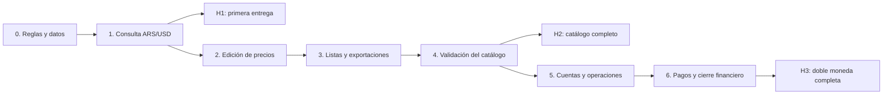

# CAS-54 — Plan de implementación de doble moneda

Fecha de revisión: **4 de octubre de 2026**, zona America/Buenos_Aires.

**Estado de implementación:** etapas 1 a 3 implementadas en el workspace. Ver [funcionalidad, contratos, validación y despliegue](CAS-54-implementacion-etapas-1-3.md). La etapa 4 de entrega y el alcance financiero de las etapas 5 y 6 siguen pendientes.

Issue: [CAS-54 — Como usuario quiero poder manejar doble moneda](https://linear.app/b2car/issue/CAS-54/como-usuario-quiero-poder-manejar-doble-moneda), estado **In Progress** al consultar Linear. El issue contiene una especificación funcional extensa; no tenía comentarios ni relaciones de bloqueo al momento de esta revisión.

Este documento convierte esa especificación en un plan técnico por entregas. **La prioridad es disponer de productos, precios por sucursal y listas de precios coherentes en ARS/USD. Las operaciones y los pagos multimoneda se implementan después.** Las decisiones identificadas como propuestas siguen pendientes de validación de negocio; escribir este plan no implica que estén aprobadas ni implementadas.

## 1. Objetivo y orden de entrega

El primer resultado usable será consultar el precio en ambas monedas con un valor del dólar explícito. El siguiente permitirá fijar el precio en ARS o USD y obtener automáticamente su equivalente. Después se completarán listas por cliente y exportaciones. Esa funcionalidad podrá entregarse aunque las operaciones financieras todavía funcionen en ARS.

| Etapa | Prioridad | Resultado visible | Dependencia |
| --- | --- | --- | --- |
| 0. Preparación y decisiones | P0 | Reglas, contratos y revisión de datos definidos | Ninguna |
| 1. Cotización y consulta de precios | P0 | Productos, stock y lista general muestran ARS/USD calculados | Etapa 0 |
| 2. Carga de precios y adopción de datos | P0 | Un precio principal ARS o USD por producto/sucursal, con equivalente calculado | Etapa 1 |
| 3. Listas por cliente y exportaciones | P0 | Descuentos, margen, PDF y Excel usan el mismo contexto monetario | Etapas 1 y 2 |
| 4. Validación y entrega del catálogo | P0 | Catálogo completo habilitado para uso habitual | Etapas 1 a 3 |
| 5. Cuentas y compras/ventas multimoneda | P1 posterior | Operaciones pactadas en ARS/USD y cuentas con moneda fija | Etapa 4 |
| 6. Pagos combinados y cierre financiero | P1 posterior | Cobros/pagos mixtos, reversión, movimientos, flete y reportes | Etapa 5 |

**Hitos:** H1 = consulta en doble moneda al terminar la etapa 1; H2 = catálogo completo al terminar la etapa 4; H3 = alcance financiero de CAS-54 al terminar la etapa 6. H1 y H2 son entregas parciales: CAS-54 no debería darse por terminado mientras reste el alcance financiero aceptado.



## 2. Estado actual verificado en el código

La revisión se realizó sobre backend `1f130a4` y frontend `f24dea6`. Ambos repositorios estaban sin cambios locales antes de crear este documento. Se revisaron fuentes, migraciones y contratos; **no se consultó una base de datos en esta revisión ni se verificó el esquema de producción**. Las comprobaciones de base mencionadas en la descripción del issue pertenecen a su revisión previa.

| Área | Evidencia actual | Trabajo necesario |
| --- | --- | --- |
| Cotización | `sucursal.valor_dolar DECIMAL(12,4)` ya existe, se expone por API y se edita en Configuración → Sucursales. No se encontró su uso en el cálculo de precios revisado. | Resolver la convivencia con la cotización por empresa propuesta en el issue. No crear dos fuentes activas del dólar. |
| Precio global | `producto.precio_base DECIMAL(14,2)` representa ARS. `Producto` y su catálogo solo exponen ese precio base. | Agregar referencia monetaria, precio base USD y lectura resuelta. |
| Precio por sucursal | `producto_sucursal` ya tiene `precio_venta_ars DECIMAL(14,2)` y `precio_venta_usd DECIMAL(14,4)`. `StockForm` envía ambos como importes independientes. | Elegir un importe principal y derivar el otro; revisar los pares heredados. |
| Lista general | `useListaPrecios` carga todo el stock, filtra/ordena en memoria y pagina de a 10. PDF y Excel reciben `items`, que contiene toda la selección filtrada. | Mantener el alcance completo de exportación e incorporar cotización y referencia. |
| Lista por cliente | `ClienteListaPreciosModal` calcula la cascada en el frontend sobre `precioVentaArs`; calcula USD descontando el valor USD persistido. | Evitar equivalentes desactualizados y resolver el precio final con una cotización común. |
| Motor de ventas | `DescuentoEngineService` usa `producto.precio_base`; el editor de ítems toma `precioVentaArs` o `precioBase`. La selección del precio de origen ya difiere entre consumidores. | Hacer explícito el origen del precio y preservar las reglas comerciales durante la incorporación monetaria. |
| Descuentos y margen | Hay utilidades de cascada en backend y frontend. La validación de configuración de sucursal compara costo y precio ARS. | Resolver primero el precio; comparar costo y precio en la misma moneda. |
| Mapeo de importes | `stock.client.ts` transforma precios ausentes en `0`. Algunos renderizados usan comprobaciones por valor verdadero. | Distinguir precio cero, precio ausente y equivalente no disponible. |
| Ordenamiento | Productos ordena `precioBase` por `p.precio_base`; stock no tiene precios en su mapa de columnas ordenables. | Ordenar los precios resueltos antes de paginar, cuando el ordenamiento sea del servidor. |
| Operaciones y cuentas | Existen pares ARS/USD en varias tablas; deuda, acumulados y `ajustarSaldos` utilizan ARS. | No habilitar dinero USD hasta adaptar todos los cálculos y sus reversiones. |
| Autorización | Hay tablas de roles/permisos y roles por sucursal. `authMiddleware` autentica; no establece por sí solo autorización para actualizar el dólar de toda la empresa. | Incorporar un control específico de permiso en la escritura de cotización. |

La existencia de columnas USD no acredita conversión correcta ni soporte financiero USD. Tampoco debe utilizarse el cociente entre precios heredados para inferir una cotización histórica.

## 3. Reglas de diseño para el catálogo

### 3.1 Un único precio comercial principal

Cada precio global o de sucursal tendrá una moneda de referencia y un importe principal. Consultar la otra moneda no cambia esa referencia. Las conversiones son:

```text
precio_ars = precio_usd × cotizacion_usd_ars
precio_usd = precio_ars ÷ cotizacion_usd_ars
```

| Precio principal | Dólar de prueba | Precio mostrado | Dólar posterior | Resultado posterior |
| --- | --- | --- | --- | --- |
| USD 100 | ARS 1.000 por USD | ARS 100.000 / USD 100 | ARS 1.200 por USD | ARS 120.000 / USD 100 |
| ARS 100.000 | ARS 1.000 por USD | ARS 100.000 / USD 100 | ARS 1.200 por USD | ARS 100.000 / USD 83,3333 |

Las cotizaciones de los ejemplos son datos de prueba. No representan valores de mercado.

### 3.2 Cotización por empresa y campo heredado de sucursal

**Propuesta de partida:** una referencia manual por tenant, presentada como `1 USD = X ARS`, con fecha de actualización, usuario que la modificó y versión. Es la opción que sigue la propuesta de CAS-54 y permite consultar el precio global sin elegir una sucursal.

`sucursal.valor_dolar` debe incluirse en el inventario de datos. Si las sucursales tienen valores diferentes, el administrador elegirá explícitamente la referencia de empresa. Si coinciden, se podrá ofrecer ese valor como sugerencia, sin atribuirle una fecha histórica que no existe. Un `updated_at` genérico de sucursal no demuestra cuándo cambió su dólar.

Con el catálogo nuevo habilitado, Configuración → Sucursales mostrará la referencia central y un acceso a su configuración. El campo antiguo se conservará para trazabilidad, con su edición deshabilitada para ese tenant también en backend. El resolver no tendrá un fallback silencioso al dólar de sucursal.

Si negocio necesita cotizaciones diferentes por sucursal, esa decisión se debe tomar en la etapa 0: cambiaría la clave del contexto, el precio global sin sucursal, la caché y las exportaciones. No debe agregarse después como otra cotización que compita con la de empresa.

### 3.3 Precio global y precio de sucursal

El precio base global sigue siendo una sugerencia al crear una configuración de sucursal. Copiar la sugerencia debe producir un precio de sucursal explícito, con su referencia. Modificar después el precio global no cambia automáticamente las sucursales.

Cada sucursal mantiene su propio precio principal. El cambio del dólar sí cambia sus equivalentes. Un precio de sucursal ausente se muestra como ausente; no se incorpora una herencia dinámica nueva ni se reemplaza por cero.

Las diferencias actuales en selección de precio deben hacerse explícitas mediante un contexto `BASE_GLOBAL` o `VENTA_SUCURSAL`. El resolver monetario se comparte, pero incorporar moneda no debe cambiar silenciosamente el origen comercial de las ventas actuales. La política definitiva para nuevas operaciones se acuerda antes de la etapa 5.

### 3.4 Cotización ausente o modificada durante la carga

Sin cotización válida se podrá consultar un precio ARS existente; el equivalente USD será `null`, con el mensaje «Configurá el valor del dólar para calcular el precio». No se utilizará una tasa `0`, `1` ni un valor implícito.

Guardar un precio vinculado requiere una cotización válida. Editar solo datos no monetarios de un producto existente no debe quedar bloqueado por no haber dólar. La escritura monetaria envía la versión de cotización que el usuario vio; si cambió, el servidor responde un conflicto y el formulario conserva sus datos, muestra la nueva previsualización y exige confirmarla.

Cambiar la moneda de referencia es una acción explícita: «Usar USD como referencia» o «Usar ARS como referencia». El usuario verá el nuevo principal y la diferencia de redondeo antes de guardar. No se cambiará la referencia por escribir en una celda que el usuario creía informativa.

### 3.5 Descuentos, costo y precisión

Los costos de reposición existentes permanecen en ARS. En las listas, la cascada se evalúa en la moneda del principal de cada fila y el costo se convierte a esa moneda cuando sea necesario. El resultado en la otra moneda se deriva del **precio final principal**, usando la misma cotización. Así un principal USD conserva su precisión sin hacer una ida y vuelta por un ARS ya redondeado. No se ejecutan dos cascadas independientes. La etapa 5 extenderá la evaluación a la moneda de operación elegida por el usuario.

La incorporación de doble moneda conservará los niveles, prioridades y tratamiento de IVA vigentes. El catálogo global, la lista general de sucursal y la lista por cliente deben rotular qué precio muestran; agregar conversión no debe introducir descuentos donde hoy no se aplican.

Se propone conservar ARS unitario a 2 decimales, USD unitario a 4 y dólar a 6. Los cálculos intermedios usarán más precisión y redondeo comercial explícito. Se redondea el resultado principal a su escala y se calcula el equivalente desde él, redondeando después a la escala destino; no se reconstruye el principal desde el equivalente mostrado. El formulario y la vista detallada deben permitir verificar los cuatro decimales USD; no se puede perder precisión al volver a guardar un valor mostrado con solo dos.

La base utilizará `NUMERIC`; el servidor trabajará con decimales desde cadenas, sin convertir primero a `number`. Se propone `decimal.js` con precisión configurada y `ROUND_HALF_UP`; la elección y versión se cerrarán al implementar. PostgreSQL documenta `numeric` como exacto y su redondeo de empates alejándose de cero; se verificarán resultados equivalentes entre SQL y el resolver. [Tipos numéricos de PostgreSQL](https://www.postgresql.org/docs/current/datatype-numeric.html), [API de decimal.js](https://mikemcl.github.io/decimal.js/).

## 4. Esquema y contratos propuestos para las primeras entregas

Estos nombres son propuestas de implementación, no columnas ni rutas ya creadas.

### 4.1 Cambios de esquema del catálogo

| Tabla | Campo propuesto | Tipo / regla | Uso |
| --- | --- | --- | --- |
| `tenant` | `cotizacion_usd_ars` | `NUMERIC(18,6)`, nullable; finita y positiva cuando existe | Referencia manual actual |
| `tenant` | `cotizacion_actualizada_at` | `TIMESTAMPTZ`, nullable | Fecha específica de la referencia |
| `tenant` | `cotizacion_actualizada_por` | UUID de usuario, nullable | Autor de la última actualización |
| `tenant` | `cotizacion_version` | `BIGINT NOT NULL DEFAULT 0` | Control de concurrencia; aumenta con cada actualización |
| `producto` | `moneda_precio_base` | `TEXT NOT NULL DEFAULT 'ARS'`, `CHECK` ARS/USD | Identifica el principal |
| `producto` | `precio_base_usd` | `NUMERIC(14,4)`, nullable | Principal cuando la referencia es USD |
| `producto_sucursal` | `moneda_precio_venta` | `TEXT NOT NULL DEFAULT 'ARS'`, `CHECK` ARS/USD | Selecciona el principal entre las columnas existentes |
| `producto_sucursal` | `precio_referencia_confirmada` | `BOOLEAN NOT NULL DEFAULT FALSE` | Distingue adopción explícita de pares heredados; nuevos precios se crean confirmados |

`precio_base` y `precio_venta_ars` conservan su significado ARS; no se reutilizan para guardar un importe USD. Cuando la referencia sea USD, la columna USD será la fuente y el ARS persistido, si se mantiene por compatibilidad, será solamente una representación de la última escritura.

Toda lectura nueva resolverá ambos importes desde el principal y la cotización del contexto. **Actualizar el dólar no ejecuta un UPDATE masivo de productos.** El mismo criterio se aplicará a los consumidores ARS que deban seguir funcionando durante la transición.

Las restricciones verificarán el importe principal cuando exista precio, sus rangos y las monedas admitidas. Un producto puede seguir sin precio. Debe rechazarse cotización no finita, importe negativo, exceso de escala y conversión fuera del rango de la columna destino; `CHECK > 0` no sustituye la validación de valores especiales. Los precios cero conservarán la política vigente y se distinguirán de ausencia.

La incorporación inicial de referencia ARS es una convención de compatibilidad para datos históricos, no una deducción sobre el significado del USD anterior. Los USD heredados se conservan y se muestran en la revisión de normalización.

### 4.2 Contrato de lectura

Mantener rutas existentes y el envoltorio `status/data/page`; agregar campos explícitos para el contexto y los precios resueltos. La etapa 1 puede habilitar la lectura nueva con `precios=resueltos` para no cambiar de golpe los consumidores actuales. Los clientes del catálogo deberán pedir ese contexto y conservar sus metadatos.

Ejemplo conceptual de un elemento de producto/sucursal, omitiendo los demás atributos y el envoltorio de respuesta:

```json
{
  "precio_resuelto": {
    "moneda_referencia": "USD",
    "importe_referencia": "100.0000",
    "ars": "120000.00",
    "usd": "100.0000",
    "estado": "VINCULADO"
  },
  "contexto_monetario": {
    "cotizacion_usd_ars": "1200.000000",
    "cotizacion_version": "3",
    "actualizada_at": "2026-10-04T18:00:00Z"
  }
}
```

Estados sugeridos: `VINCULADO`, `SIN_PRECIO`, `SIN_COTIZACION`, `LEGADO_PENDIENTE_REVISION`. Las vistas usarán los resueltos; no tomarán una columna derivada persistida como principal alternativo. En colecciones, el contexto puede estar en metadatos comunes para no repetirlo por fila, manteniendo las variantes paginadas y sin paginar.

Los campos monetarios nuevos viajan como cadenas decimales y la versión como cadena entera. Los adaptadores se ocuparán del formateo y del orden numérico; ordenar cadenas como texto produciría resultados incorrectos. Los campos viejos se conservan durante la transición y sus consumidores activos se adaptan antes de habilitar principales USD.

### 4.3 Escritura de cotización y precios

Rutas nuevas sugeridas: `GET /api/configuracion/cotizacion` y `PATCH /api/configuracion/cotizacion`. La lectura devuelve también si el usuario puede actualizarla. El PATCH recibe valor y versión esperada; determina empresa y usuario desde la sesión.

```json
{
  "cotizacion_usd_ars": "1200.000000",
  "version_esperada": "2"
}
```

La actualización se hará mediante comparación de versión y aumento atómico. Un conflicto devuelve `409`; validación, `400`; falta de permiso, `403`. Puede extenderse `errorResponse` con un `code` opcional sin quitar `message`, para identificar `COTIZACION_CAMBIO` o `COTIZACION_REQUERIDA`.

Para productos y producto/sucursal se conservan POST/PATCH, incorporando una entrada comercial única:

```json
{
  "precio": {
    "moneda_referencia": "USD",
    "importe_referencia": "100.0000",
    "cotizacion_version": "3"
  }
}
```

Backend valida y calcula el equivalente. No acepta dos decisiones contradictorias ARS/USD. La validación de versión y la escritura ocurren dentro de la misma transacción, con bloqueo compartido de la referencia mientras se guarda; actualizar el dólar necesita el bloqueo de escritura correspondiente. Así se evita el cambio de cotización entre validación y persistencia.

PATCH no monetario no necesita dólar. Limpiar explícitamente un precio se distinguirá de omitirlo. Un cliente antiguo puede seguir leyendo; una escritura monetaria que no pueda expresar la referencia o la versión exigidas recibirá un error concreto, conservando los datos. Se coordinará el despliegue de formularios antes de exigir el contrato nuevo.

## 5. Implementación por etapas

### Etapa 0 — Preparación de reglas y datos

**Objetivo:** cerrar las decisiones necesarias para comenzar por listados y detectar datos que requieren adopción explícita.

- [ ] Confirmar referencia del dólar por empresa y política de convivencia con `sucursal.valor_dolar`.
- [ ] Registrar como regla propuesta un principal por precio y el otro derivado; definir si se admite precio cero y cómo se limpia un precio.
- [ ] Acordar precisión, redondeo, mensajes de ausencia y moneda que muestra cada lista.
- [ ] Inventariar, por tenant, dólar de sucursales, precios ARS/USD presentes, valores inválidos, productos sin precio y discrepancias. Con cotización elegida, preparar una previsualización de normalización; no inferir tasa mediante cocientes.
- [ ] Identificar la diferencia entre `BASE_GLOBAL` y `VENTA_SUCURSAL`, y los perfiles de descuentos de lista por cliente y venta. Mantener esas reglas durante la conversión y separar cambios comerciales adicionales.
- [ ] Definir quién recibe `cotizacion.actualizar` usando roles/permisos de la empresa. Propuesta: administración autorizada explícitamente, sin habilitar a cualquier usuario autenticado.
- [ ] Congelar contratos de lectura/escritura y fixtures de prueba: ARS principal, USD principal, sin cotización, par heredado discrepante y dos tenants.
- [ ] Elegir un mecanismo simple de habilitación por tenant para separar `consulta_doble_moneda`, `edicion_precio_referencia` y `finanzas_doble_moneda`; no requiere una plataforma externa.

**Entregables:** contratos, informe de datos y decisiones anotadas. **Salida:** ningún dato USD heredado se reinterpreta automáticamente y las tareas de catálogo pueden desarrollarse sin depender del reparto financiero.

### Etapa 1 — Cotización y listado en doble moneda

**Objetivo:** entregar H1, consulta útil de ARS/USD para productos, stock y lista general.

**Backend y datos**

- [ ] Crear la migración aditiva de catálogo/cotización con la CLI, preservando importes anteriores. No agregar todavía columnas financieras.
- [ ] Crear controller/service/repository de cotización, rutas e integración en `src/index.ts`, siguiendo la estructura actual.
- [ ] Implementar permiso de actualización y control de tenant. Revisar también los GRANT/políticas existentes de `tenant`: la política actual de aislamiento no restringe el rol dentro de la empresa. El acceso directo por Data API no debe permitir eludir el permiso nuevo. Limitar las escrituras directas de cotización, preservando accesos necesarios verificados.
- [ ] Implementar una utilidad de conversión decimal y un resolver de precios que reciben principal, moneda, origen comercial y contexto. La cotización se obtiene una vez por petición.
- [ ] Extender lecturas de productos y producto/sucursal: lista completa, paginada con/sin total y detalle. En stock, resolver también el precio global que viaja como dato del producto.
- [ ] Para filas heredadas, mostrar el equivalente calculado como referencia ARS provisional y señalizar su revisión cuando exista USD anterior. Conservar y permitir comparar el USD original; no sobrescribirlo en esta entrega.
- [ ] Incorporar ordenamiento por ARS/USD resuelto. En queries paginadas, usar expresiones SQL parametrizadas y columnas permitidas antes de LIMIT/OFFSET; agregar desempate por id y política explícita de nulos al final.

**Frontend**

- [ ] Agregar tipos/contexto monetario y adaptar `producto.client.ts` y `stock.client.ts` para conservar `null`, estado y metadatos.
- [ ] Crear configuración del dólar con valor, fecha, permiso y control de conflicto; integrar su acceso en Configuración.
- [ ] Agregar Precio base ARS/USD en Productos y Precio venta ARS/USD en Stock; mostrar la referencia y el contexto también en detalle.
- [ ] Hacer que Lista de Precios use valores resueltos y muestre cotización y actualización en el encabezado.
- [ ] Incorporar presentación coherente de `—`, cero, USD con hasta cuatro decimales y etiquetas ARS/USD. El equivalente será de solo lectura.
- [ ] Refrescar listados al actualizar el dólar desde la aplicación y al volver a enfocar una vista. Conservar filtros, orden y sucursal; ante una recarga fallida mostrar que la vista conserva una referencia anterior.
- [ ] Mientras las listas por cliente y exportaciones no hayan sido adaptadas, indicar su condición heredada o deshabilitar esas acciones para el modo nuevo. H1 no debe ofrecer un archivo que aparente usar la referencia nueva y contenga precios antiguos.

**Compatibilidad mínima con operaciones ARS**

La entrega conserva dinero, totales y cuentas en ARS. Antes de habilitar principales USD en la etapa 2, todos los consumidores activos de precio deberán leer el ARS resuelto: editor de ítems, evaluación de descuentos y validación de margen. Se mantiene su origen comercial actual. No se incorpora todavía selector USD, pagos USD ni recálculo de operaciones confirmadas.

**Aceptación H1:** un precio ARS existente muestra USD según la referencia explícita; cambiar el dólar cambia el equivalente y la versión visible; sin dólar se conserva ARS y USD figura no disponible; pares heredados permanecen accesibles; no cambia stock ni saldos.

### Etapa 2 — Edición del principal y normalización

**Objetivo:** cargar precios fijados en ARS o USD y completar la adopción sin pérdida de datos.

- [ ] Incorporar selector de referencia e importe principal en `ProductoForm` y `StockForm`. Mostrar el equivalente calculado, dólar y versión; evitar dos inputs monetarios independientes.
- [ ] Crear un componente pequeño de edición monetaria compartido, incluyendo previsualización al cambiar de referencia y conflicto de cotización.
- [ ] Adaptar POST/PATCH y validaciones. El servidor toma principal y referencia, calcula el par y valida rangos; las ediciones no monetarias siguen disponibles.
- [ ] Validar margen de sucursal sobre precio ARS resuelto y costo ARS. Una cotización que después reduzca el margen de un principal USD no modifica el principal automáticamente: mostrar la alerta y aplicar la política de tope de descuentos vigente al generar listas.
- [ ] Completar la compatibilidad ARS descrita en la etapa 1 y verificar que ventas nuevas no tomen un equivalente persistido antiguo. Para una nueva venta afectada por conversión, conservar el contexto en la evaluación abierta y validar su versión también en backend al confirmar. Esta adaptación no ofrece equivalentes históricos USD de la operación; esos snapshots se incorporan en la etapa 5.
- [ ] Separar cambios de precio de cambios de cantidades en `StockForm`: el PATCH de precio debe omitir `cantidad_disponible` y `cantidad_reservada` cuando esas cantidades no se editaron. Cambiar precio no debe sobrescribir stock con una lectura anterior.
- [ ] Ofrecer revisión de pares heredados con ARS anterior, USD anterior, equivalente propuesto y referencia elegida. Los casos USD sin ARS también requieren elección explícita; no se eliminan ni se inventa su ARS.
- [ ] Guardar la elección explícita y marcar `precio_referencia_confirmada`. Conservar evidencia de los valores reemplazados en el informe de adopción o mecanismo de auditoría elegido antes de normalizarlos.
- [ ] Mantener sugerencia global al crear stock por sucursal; copiar principal y referencia solo por acción del usuario. No propagar luego cambios comerciales globales.
- [ ] Adaptar Configuración → Sucursales y su service para dejar de editar el dólar heredado cuando el tenant use la referencia central.

**Salida:** precio USD 100 permanece USD 100 ante cambios de dólar; precio ARS 100.000 permanece ARS 100.000; cambiar referencia exige acción explícita; no se pierden cuatro decimales USD; un conflicto de dólar no descarta el formulario.

No habilitar `edicion_precio_referencia` hasta que lecturas de catálogo y consumidores ARS activos sepan resolver un principal USD. Las modificaciones históricas de operación siguen congeladas.

### Etapa 3 — Listas por cliente, descuentos y exportaciones

**Objetivo:** que las listas compartibles y los precios por cliente representen la referencia que el usuario está viendo.

- [ ] Extender el núcleo backend de evaluación para recibir contexto monetario y origen de precio explícitos. La lista de sucursal utiliza el precio de sucursal; el precio global permanece diferenciado.
- [ ] Incorporar un perfil de evaluación de lista por cliente que conserve las reglas actuales al pasar de cálculo local a backend. La convergencia de niveles de descuento hoy diferentes se revisará como decisión comercial separada, comparando resultados ARS.
- [ ] Adaptar `ClienteListaPreciosModal` para consumir la evaluación monetaria del servidor, con alertas y margen; eliminar el cálculo autoritativo USD basado en `precioVentaUsd` persistido.
- [ ] Resolver el principal de la fila, comparar costo y precio en su moneda, ejecutar cascada y margen una vez, y derivar el precio final en la segunda moneda. Parametrizar la precisión de unitarios de la cascada, hoy centrada en ARS, para conservar cuatro decimales USD. Mantener la política actual para costo faltante, producto deshabilitado y margen perforado.
- [ ] Cargar productos, excepciones y descuentos por lote para la evaluación de listas. El motor actual consulta dentro del bucle; no agregar una consulta de cotización por producto ni replicar ese patrón para listas completas.
- [ ] Incorporar al DTO de exportación importe principal, moneda de referencia, ARS/USD final y contexto común. Un archivo utilizará una sola versión de cotización.
- [ ] Actualizar PDF/Excel general y por cliente: encabezados de moneda, sucursal/cliente, dólar, fecha de actualización de la referencia y fecha de generación. La fecha visible usará America/Buenos_Aires.
- [ ] Exportar toda la selección filtrada, conservando el comportamiento actual, aunque la tabla muestre una página. Incluir referencia por fila cuando se mezclen principales ARS/USD; en Excel agregar metadatos sin perder columnas elegibles.
- [ ] Mantener números como celdas numéricas en Excel dentro del rango de precisión soportado; evitar recalcular con fórmulas que consulten una tasa externa. USD ausente se exporta vacío, no cero.
- [ ] Mostrar advertencia en archivos con filas heredadas sin confirmar. Permitir un precio ARS sin dólar, pero identificar que su equivalente USD no está disponible.
- [ ] Al exportar, comprobar la versión. Si cambió, ofrecer actualizar y regenerar o conservar explícitamente la vista con su versión rotulada; no combinar filas tomadas antes y después del cambio.

**Salida:** tabla, PDF y Excel muestran los mismos precios para el mismo contexto. El equivalente final deriva del resultado principal, con la escala declarada; los descuentos no se aplican dos veces ni divergen entre monedas.

### Etapa 4 — Validación y entrega del catálogo

**Objetivo:** habilitar H2 sin esperar las operaciones multimoneda.

- [ ] Ejecutar la matriz de catálogo de la sección 7 con datos nuevos y heredados, dos tenants y dos sucursales con precios independientes.
- [ ] Validar migración sobre una copia local descartable de datos representativos; comparar cantidades, precios originales y número de filas antes/después. Repetir las consultas de integridad relevantes.
- [ ] Probar actualización del dólar con formularios abiertos, dos administradores actualizando y una exportación en preparación.
- [ ] Verificar permiso en API y acceso directo relevante, además de lectura aislada por tenant.
- [ ] Revisar rendimiento del listado paginado y de una exportación completa. Medir catálogo pequeño y volumen representativo; usar EXPLAIN antes de agregar índices. Una expresión que depende del dólar vigente no debe tratarse como índice inmutable de precio.
- [ ] Mantener la carga completa actual de Lista de Precios para la primera entrega si el volumen lo permite. Si las mediciones exigen paginación de servidor, agregar una consulta de exportación de toda la selección; no exportar solo la página actual como consecuencia de ese cambio.
- [ ] Activar primero un tenant de prueba, revisar discrepancias y luego habilitar consulta/edición para el resto. La normalización incompleta debe permanecer visible y medible.
- [ ] Documentar cómo cambiar el dólar, elegir referencia, revisar pares antiguos y leer los exportados.

**Criterio de entrega H2:** consultar, cargar y compartir precios ARS/USD funciona de punta a punta; cambiar el dólar modifica exclusivamente equivalentes; compras/ventas ARS siguen funcionando y el historial conserva importes. El cierre financiero USD no es condición para esta entrega.

**Reversión del despliegue:** deshabilitar nuevas ediciones USD y revertir la interfaz si fuera necesario, conservando esquema y un backend que entienda las referencias ya guardadas. Después de crear principales USD, volver a un backend antiguo que los interpreta como ARS sería una reversión insegura. No eliminar columnas ni convertir datos para hacer rollback.

### Etapa 5 — Cuentas y operaciones pactadas en ARS/USD

**Objetivo:** agregar moneda de operación y dinero en cuentas de moneda fija sobre el catálogo ya estabilizado.

- [ ] Validar las decisiones financieras pendientes del issue: moneda fija por cuenta, política de recargos diferidos y precio comercial de origen de nuevas operaciones.
- [ ] Agregar `cuenta_financiera.moneda`, `operacion.moneda_operacion`, `operacion.cotizacion_usd_ars` y snapshots necesarios de pago. Migrar cuentas/operaciones históricas como ARS, sin convertir saldos ni inferir dólares reales de campos USD anteriores.
- [ ] Completar `importe_aplicado_operacion` histórico desde `monto_ars`; mantener cotización histórica nula cuando no exista evidencia. Revisar manualmente cuentas que se usaron como caja USD pese al cálculo ARS.
- [ ] Implementar moneda fija por cuenta. Una caja física con ambas monedas se representa con dos cuentas. Etiquetar saldo inicial/actual y mostrar totales separados ARS/USD.
- [ ] Extender controller/service/repository de operaciones para precios, IVA, descuentos, total y deuda en moneda pactada. Backend calcula los pares desde los datos principales, sin confiar en totales duplicados del cliente.
- [ ] Resolver los ítems con la cotización de origen confirmada, admitiendo una referencia de operación distinta de la de catálogo. Cambiar ese dólar vuelve a evaluar ítems y margen de la operación abierta; no cambia el producto.
- [ ] Conservar snapshots por ítem de precio/costo, total y cotización al confirmar. Operaciones confirmadas no se recalculan desde catálogo ni dólar actual.
- [ ] Adaptar el motor de margen: costo de reposición ARS convertido con dólar de origen cuando la operación sea USD. No comparar importes de distintas monedas.
- [ ] Adaptar `ajustarSaldos`, reversión de pagos y cancelación para usar importe nativo y snapshots dentro de la transacción. Ninguna operación USD se habilita antes de que su eliminación/cancelación pueda revertirse correctamente.
- [ ] Extender interfaces, mapeos y formularios de compra/venta. Inicialmente admitir pendiente y financiación inmediata en la misma moneda de la operación; mantener cuentas distintas de esa moneda fuera del selector hasta la etapa 6.
- [ ] Cotización obligatoria para operación/pago USD incluso si cuenta y deuda son USD; el dólar se conserva para equivalentes y margen. ARS sin conversión puede mantener cotización nula.
- [ ] Mostrar importe original, moneda, dólar de origen y equivalentes históricos en lista/detalle; conservar stock y sus estados físicos actuales.

**Salida:** deuda USD 100 permanece USD 100 ante cambio de referencia; cuenta USD recibe USD 100, no ARS 100; cancelar esa operación revierte dinero nativo y stock efectivamente impactado. Una operación histórica ARS conserva total, deuda y saldo original.

### Etapa 6 — Pagos combinados, movimientos y cierre financiero

**Objetivo:** completar el alcance financiero especificado sin alterar las entregas del catálogo.

- [ ] Admitir cuentas ARS y USD en pago único, reparto por monto, porcentaje y partes iguales; cada fila muestra dinero real, dólar y cobertura de la deuda.
- [ ] Guardar `moneda_pago`, `cotizacion_usd_ars` del pago e `importe_aplicado_operacion`. La moneda real procede de la cuenta validada en backend.
- [ ] Calcular pendiente/estado sumando cobertura en moneda de operación, y actualizar cuentas solo por su importe nativo. No sumar ambas representaciones como dos ingresos.
- [ ] Implementar pagos parciales con dólar propio por fecha/pago y recargos conforme a la decisión aceptada. Propuesta del issue: recargo inmediato forma parte del total pactado; un pago diferido no agrega automáticamente otro recargo.
- [ ] Redondear dinero real, saldos y deuda a dos decimales; conservar cobertura con precisión intermedia. La última fila puede absorber un resto visible. Si la precisión pagable no permite cerrar a un centavo de la moneda de deuda, exigir ajuste, parcial o excedente explícito.
- [ ] Implementar la eliminación del pago con reversión exacta de dinero nativo y cobertura guardada. Cancelación usa snapshots originales; no convierte con el dólar del día.
- [ ] Mantener transacción de operación/pago/estado/saldo y orden consistente de bloqueo de cuentas. Probar pagos concurrentes, rechazo de cuenta de otro tenant, cancelación y eliminación mientras hay pagos en curso.
- [ ] Adaptar `PagoEditor`, `pago.ts`, `RegistrarPagoModal` y detalle de operación, incluyendo excedente y confirmación. Preservar el bloqueo vigente de nuevos pagos sobre operaciones saldadas/sobrepagadas.
- [ ] Extender movimientos manuales con importes nativos y moneda de resumen. No introducir una transferencia ARS→USD como dos movimientos sin vínculo atómico.
- [ ] Agregar flete USD de traslado y su pago inmediato, manteniendo el movimiento físico y la ausencia de afectación financiera cuando no hay flete.
- [ ] Separar en listados/reportes total comercial histórico, deuda por moneda y dinero ingresado/egresado por moneda. Un consolidado estimado debe identificar su dólar de consulta; un consolidado histórico usa snapshots e identifica registros sin tasa.
- [ ] Habilitar pagos mixtos solo al verificar los casos del issue y sus reversiones. Mantener transferencias/cambio de dinero entre cuentas en un ticket separado salvo decisión explícita de incluirlos.

**Salida H3:** se cumplen los casos financieros de CAS-54, incluyendo deuda con cotización variable, pagos combinados, recargos aceptados, pagos concurrentes, cancelaciones, flete y saldos separados.

## 6. Mapa de archivos y cambios

Las rutas siguientes son relativas a cada repositorio. Los componentes marcados como «nuevo» son propuestas. No se editarán manualmente las páginas generadas de `openwiki/`.

| Etapa | Backend | Frontend |
| --- | --- | --- |
| 1 | `supabase/migrations/` — migración nueva; `src/index.ts`; nuevos `cotizacion.controller/service/repository/routes.ts`; nuevos resolver de precio y utilidad monetaria; `producto.repository/service/controller.ts`; `producto-sucursal.repository/service/controller.ts` | `lib/types/Producto.ts`, `Stock.ts`, nuevo `Moneda.ts`; `api/producto.client.ts`, `stock.client.ts`, nuevo `cotizacion.client.ts`; `utils/formatters.ts`; `ProductosCatalogo`, `StockCatalogo`, `ListaPreciosCatalogo`, `useListaPrecios`, `ConfiguracionView` y nuevo componente de cotización |
| 2 | Escrituras y validaciones de producto/producto-sucursal; `sucursal.service.ts`; lectura monetaria de `descuento-engine.service.ts`; control de precio en consumidores ARS | `ProductoForm.tsx`, `StockForm.tsx`, nuevo editor monetario; detalles de producto/stock; `SucursalesConfiguracion.tsx`; adaptación mínima de `ItemsEditor.tsx`/`VentaForm.tsx` |
| 3 | `descuento-engine.controller/service.ts`, `utils/cascada-descuentos.ts`; evaluación por lote y perfil explícito de lista | `api/descuento-engine.client.ts`; `ClienteListaPreciosModal.tsx`, `validarMargenListaPrecios.ts`; `_lib/exportColumns.ts`, `exportPdf.ts`, `exportExcel.ts`; `exportPdfCliente.ts`, `exportExcelCliente.ts` |
| 4 | Pruebas de contratos, integridad y tenant; habilitación por empresa | Pruebas de formularios/listas/exportación, estados vacíos y conflictos; documentación de uso |
| 5 | Migración financiera; `cuenta-financiera.*`; `operacion.controller/service/repository.ts`; `reparto-cuentas.ts`; motor de descuentos | Tipos `CuentaFinanciera`, `Operacion`, `OperacionCrear`, `OperacionDetalle`, `MovimientoCuenta`; clientes de cuentas/operaciones; formularios y detalle |
| 6 | Pagos/reversión/estados en `operacion.repository.ts`; reparto mixto; consultas de cuentas y reportes | `PagoEditor.tsx`, `pago.ts`, `RegistrarPagoModal.tsx`, formularios de movimiento/traslado; catálogos y detalle de cuentas/operaciones |

La ruta real de los módulos frontend es `src/app/(modulos)/...`; tipos/clientes/utilidades están en `src/lib/...`. El backend conserva Controller → Service → Repository y utilidades pequeñas; no requiere una jerarquía nueva de operaciones ni un subsistema contable para entregar el catálogo.

## 7. Matriz de aceptación y pruebas

### 7.1 Catálogo — necesarias para H2

| Caso | Entrada / acción | Resultado esperado |
| --- | --- | --- |
| Principal USD | USD 100, dólar 1.000 → 1.200 | USD 100 constante; ARS 100.000 → 120.000 |
| Principal ARS | ARS 100.000, dólar 1.000 → 1.200 | ARS constante; USD 100 → 83,3333 |
| Sin dólar | Precio ARS existente, cotización nula | ARS legible; USD `null`; guardado de precio vinculado bloqueado con mensaje concreto |
| Edición no monetaria | Cambiar descripción sin dólar | Se guarda sin modificar precio ni inventar equivalente |
| Datos heredados | ARS 100.000 y USD 120, dólar elegido 1.000 | Se conservan originales; revisión visible; no se normaliza en silencio |
| USD heredado sin ARS | Solo USD histórico disponible | Se conserva; se solicita elegir referencia; no se transforma en ARS cero |
| Dos sucursales | Principales independientes para el mismo producto | Cambiar precio global no los propaga; dólar actualiza sus derivados |
| Cambio de referencia | ARS 100.000 → usar USD con dólar 1.200 | Se previsualiza el nuevo principal USD y su redondeo; referencia cambia solo al confirmar |
| Conflicto de dólar | Formulario usa versión 3; servidor ya está en 4 | `409`, datos conservados y nueva previsualización antes de reintentar |
| Escrituras concurrentes | Dos actualizaciones de dólar con misma versión | Una se confirma; otra informa conflicto; no hay pérdida silenciosa |
| Descuento | Principal USD 100, dólar 1.200 y descuento 10%, sin tope | ARS final 108.000 y USD final 90; misma evaluación en tabla y archivo |
| Margen topeado | Costo ARS y descuento que perfora el mínimo | Costo comparable en moneda principal, tope/alerta vigente y equivalente derivado del resultado final |
| Precisión | Principal USD 0,1234 | Cuatro decimales conservados al guardar, leer y editar de nuevo |
| Ausencia y cero | Un precio nulo y otro cero admitido | Distintos estados; ni la API ni la UI convierten ausencia en cero |
| Orden/paginación | Mezcla de principales ARS/USD; ordenar por ARS o USD | Orden numérico global por precio resuelto, nulos al final y sin ordenar solo la página |
| Exportación completa | Lista filtrada de 25 ítems, tabla muestra 10 | Archivo contiene 25 ítems y el mismo contexto monetario |
| Exportación concurrente | Dólar cambia antes de generar archivo | Actualización o conservación explícita de versión; nunca filas con tasas mezcladas |
| Aislamiento | Usuario tenant A pide producto o cotización de B | No obtiene ni modifica datos de B |
| Permiso | Usuario sin permiso actualiza cotización | Rechazo en API y sin vía directa relevante para eludirlo |
| Compatibilidad ARS | Nueva venta ARS sobre principal USD ya habilitado | Toma ARS resuelto vigente con referencia confirmada; stock y cuentas siguen ARS |
| Historial | Cambiar dólar/precio tras confirmar una venta | Venta, deuda y pagos anteriores conservan importes originales |
| Cantidades | Editar solo precio mientras hubo movimiento de stock | No se pisan cantidades con la lectura vieja del formulario |

### 7.2 Finanzas — necesarias para H3

| Caso | Resultado esperado |
| --- | --- |
| Deuda ARS 100.000; cobrar USD 100 a 1.000 | Cuenta USD +100; cobertura ARS 100.000; SALDADA |
| Deuda ARS 100.000; ARS 40.000 + USD 60 a 1.000 | Cada cuenta cambia en su moneda; SALDADA |
| Deuda USD 100; ARS 50.000 a 1.000 y ARS 60.000 a 1.200 | Cobertura USD 50 + 50; ingreso real ARS 110.000 |
| Eliminar segundo pago del caso anterior | Se revierten ARS 60.000 y cobertura USD 50 históricos; pendiente USD 50 |
| Cancelar venta con pago mixto | Reversión de dinero nativo y stock efectivamente entregado, con snapshots originales |
| Recargo inmediato/diferido | Total y cobertura siguen la política aprobada; ningún recargo se cobra dos veces |
| Redondeo USD→ARS | No se amplía tolerancia para ocultar diferencia; ajuste/parcial/excedente visible |
| Pagos simultáneos | Deuda, estado y saldos coherentes; transacción y bloqueos evitan actualizaciones perdidas |
| Saldos ARS y USD | Totales separados; no se suman nominales de monedas distintas |
| Flete USD | Debita la cuenta correcta, puede revertirse y mantiene el stock del traslado |

### 7.3 Ejecución de validaciones durante la implementación

Estas pruebas son trabajo planificado; no fueron ejecutadas al redactar este documento.

| Cambio | Verificación |
| --- | --- |
| Resolver monetario | Unitarias de principal ARS/USD, escalas, redondeo, nulos, tasa inválida y overflow |
| SQL y migración | Aplicar en base local descartable; consultas reales de lectura, restricciones, actualización de versión, tenant e integridad; comparar resolver SQL/TypeScript |
| API | Pruebas de controlador/servicio para permisos, `409`, PATCH no monetario, DTO y paginación ordenada |
| Formularios/listas | Pruebas de interacción sobre cambio de referencia, precisión, conservación de datos ante conflicto y ausencia de dólar |
| Exportaciones | Verificar DTO, selección completa y metadatos; inspeccionar un PDF y un Excel de muestra, incluyendo múltiples páginas |
| Finanzas | Integración transaccional contra PostgreSQL para pago concurrente, reversión y cancelación; mocks solos no acreditan bloqueos correctos |

Reutilizar Vitest y los patrones existentes. Comandos de referencia en cada repositorio, corriendo primero las pruebas afectadas:

```powershell
# Backend
npm test -- src/services/producto-sucursal.service.test.ts src/services/descuento-engine.service.test.ts src/utils/cascada-descuentos.test.ts
npm run build

# Frontend
npm run test -- --run
npm run lint
npm run build
```

Las pruebas nuevas se agregarán según los cambios concretos; la selección backend de ejemplo no sustituye las de cotización/resolver/contratos. Para esquema, verificar versión y ayuda de la CLI instalada antes de usar comandos. Crear cada migración con `supabase migration new <nombre>`, no inventar timestamps ni modificar migraciones ya aplicadas. [Migraciones de Supabase](https://supabase.com/docs/guides/deployment/database-migrations).

Un reset de base solo corresponde a un entorno local descartable identificado para las pruebas. Las consultas de integridad y transacciones se realizarán antes de activar cada entrega.

## 8. Dependencias, riesgos y límites de alcance

| Riesgo concreto | Prevención / etapa |
| --- | --- |
| Dos valores del dólar compiten entre empresa y sucursal | Decidir alcance en etapa 0; deshabilitar la edición heredada al activar referencia central |
| Precios USD anteriores representan decisiones independientes | Conservar originales; previsualizar y confirmar normalización en etapa 2 |
| Equivalente persistido queda viejo al cambiar dólar | Resolver en lectura y adaptar consumidores ARS antes de aceptar principales USD |
| Unificar motor cambia precios por cambiar el origen o niveles de descuento | Contexto/perfil explícitos y comparación de salida ARS en etapa 3; cambios comerciales separados |
| Catálogo grande demora listado o evaluación por cliente | Contexto por petición, cargas por lote y medición antes de cambiar paginación |
| Un exportado mezcla cotizaciones o pierde precisión | Snapshot común del DTO, versión comprobada y reglas de presentación/escala |
| Permiso solo se protege en la interfaz | Control backend y revisión acotada de políticas/GRANT de las columnas afectadas |
| Edición de precio sobrescribe stock | PATCH de precio sin cantidades que no se editaron |
| Backend viejo no entiende principales USD tras rollback | Conservar backend compatible; deshabilitar edición nueva sin reinterpretar datos |
| Habilitar cuentas USD antes de adaptar saldos y reversiones | Gate financiero posterior; no ofrecer USD hasta superar las pruebas transaccionales |

No se necesita una tabla de historial de cotizaciones para resolver el catálogo manual inicial; versión, última actualización y evidencia de adopción cubren esa entrega. Las operaciones/pagos posteriores guardarán su propia cotización. Si se requiere auditoría de cada cambio de dólar, incluir una tabla de historial en un alcance específico.

Quedan fuera de la primera entrega: proveedores automáticos de dólar, selección oficial/MEP/blue, costos de reposición con referencia USD, propagación masiva de precios comerciales, transferencias/cambio de dinero entre cuentas, una cuenta con dos saldos, cuenta corriente nueva de cliente/proveedor y cálculo contable/fiscal de diferencia de cambio. Las funcionalidades financieras del issue se conservan en etapas 5 y 6.

Si se crea una tabla/vista adicional durante la implementación, definir sus permisos expresamente y RLS según su acceso; una vista de precios no debe saltarse el aislamiento. El cambio de exposición automática de tablas nuevas de Supabase no afecta la conexión PostgreSQL directa usada por estos repositorios, pero no debe suponerse que crea GRANT para una ruta Data API nueva. [Cambio de exposición de tablas de Supabase](https://supabase.com/changelog/45329-breaking-change-tables-not-exposed-to-data-and-graphql-api-automatically).

## 9. Desglose sugerido del trabajo y esfuerzo orientativo

Se recomienda dividir CAS-54 en subtareas por entregable. Estos son títulos propuestos; no se crearon ni modificaron issues en Linear al preparar el documento.

| Subtarea propuesta | Etapa | Depende de |
| --- | --- | --- |
| Definir contexto monetario y revisar dólar/precios heredados | 0 | — |
| Configurar cotización por empresa con permiso y versión | 1 | Reglas de contexto |
| Resolver y consultar precio global/sucursal en ARS/USD | 1 | Cotización y migración |
| Mostrar doble moneda en Productos, Stock y Lista de Precios | 1 | Contratos de lectura |
| Cargar principal ARS/USD y revisar precios heredados | 2 | Resolver; consumidores ARS compatibles |
| Resolver listas por cliente con contexto común | 3 | Principal y perfil comercial definidos |
| Exportar PDF/Excel coherentes con lista y cotización | 3 | DTO de lista |
| Validar y habilitar el catálogo por tenant | 4 | Edición y exportaciones |
| Agregar moneda fija a cuentas y snapshots de operación | 5 | H2 y decisiones financieras |
| Crear compra/venta ARS/USD con reversión segura | 5 | Cuentas y cálculo financiero |
| Registrar pagos mixtos/parciales y revertirlos | 6 | Operaciones y deuda en moneda pactada |
| Completar movimientos, flete y reportes por moneda | 6 | Pagos y saldos nativos |

Estimación inicial para una persona con conocimiento del proyecto, incluyendo backend, frontend y validación de cada etapa:

| Etapa | Días efectivos orientativos |
| --- | --- |
| 0 | 1–2 |
| 1 | 3–5 |
| 2 | 3–5 |
| 3 | 4–6 |
| 4 | 1–3 |
| Catálogo completo H2 | **12–21** |
| 5 | 5–8 |
| 6 | 6–10 |
| Alcance financiero adicional | **11–18** |

Son rangos de planificación, no un compromiso de fechas. La conciliación de datos heredados, las decisiones comerciales y las pruebas financieras pueden ampliar el esfuerzo. El primer hito de consulta permite obtener valor antes de completar H2.

## 10. Decisiones que deben quedar asentadas

| Decisión | Propuesta utilizada en este plan | Momento |
| --- | --- | --- |
| Alcance del dólar | Manual por empresa; conservar `sucursal.valor_dolar` como dato heredado | Antes de etapa 1 |
| Vinculación de precios | Una referencia ARS/USD y un equivalente calculado | Antes de etapa 2 |
| Autoridad para cambiar dólar | Permiso `cotizacion.actualizar` otorgado explícitamente | Antes de activar etapa 1 |
| Origen de precio y perfil de descuentos | Explícitos; preservar reglas actuales durante conversión | Antes de centralizar etapa 3 |
| Precio de nuevas operaciones | Resolver diferencia global/sucursal sin cambiar historial | Antes de etapa 5 |
| Moneda de cuentas | Una moneda fija por cuenta | Antes de etapa 5 |
| Recargos de pagos diferidos | No agregar recargo automático a una deuda ya pactada | Antes de etapa 6 |
| Transferencias entre cuentas | Ticket separado con egreso/ingreso vinculados atómicamente | Antes de cerrar alcance financiero |

Las decisiones financieras pendientes no bloquean la preparación del catálogo. Las decisiones sobre referencia y origen comercial sí deben quedar claras antes de habilitar los comportamientos correspondientes.

## 11. Evidencia principal

- [Esquema inicial backend](../../casa-segura-backend/supabase/migrations/20260726000000_init_schema.sql): dólar por sucursal, columnas monetarias, roles/permisos y aislamiento.
- [Migración de precio base](../../casa-segura-backend/supabase/migrations/20260820000000_producto_precio_base_qr.sql): precio global ARS.
- [Repositorio de productos](../../casa-segura-backend/src/repositories/producto.repository.ts) y [repositorio de producto/sucursal](../../casa-segura-backend/src/repositories/producto-sucursal.repository.ts): lecturas, escrituras, joins y ordenamiento.
- [Validación de precio y margen por sucursal](../../casa-segura-backend/src/services/producto-sucursal.service.ts) y [motor central de descuentos](../../casa-segura-backend/src/services/descuento-engine.service.ts).
- [Repositorio de sucursales](../../casa-segura-backend/src/repositories/sucursal.repository.ts): lectura/escritura del dólar existente y rol por sucursal.
- [Repositorio de operaciones](../../casa-segura-backend/src/repositories/operacion.repository.ts) y [reparto de cuentas](../../casa-segura-backend/src/utils/reparto-cuentas.ts): acumulados, importes ARS y actualización/reversión de saldos.
- [Tipos de producto](../src/lib/types/Producto.ts), [tipos de stock](../src/lib/types/Stock.ts), [cliente de productos](../src/lib/api/producto.client.ts) y [cliente de stock](../src/lib/api/stock.client.ts).
- [Lista general y selección exportable](<../src/app/(modulos)/lista-precios/_hooks/useListaPrecios.ts>) y [lista por cliente](<../src/app/(modulos)/clientes/_components/ClienteListaPreciosModal/ClienteListaPreciosModal.tsx>).
- [Formulario de producto](<../src/app/(modulos)/productos/_components/ProductoForm.tsx>), [formulario de stock](<../src/app/(modulos)/stock/_components/StockForm.tsx>) y [configuración de sucursales](<../src/app/(modulos)/configuracion/_components/SucursalesConfiguracion.tsx>).
- [Editor de ítems de operación](<../src/app/(modulos)/operaciones/_components/OperacionForm/ItemsEditor.tsx>) y [formulario de venta](<../src/app/(modulos)/operaciones/_components/OperacionForm/VentaForm.tsx>): consumidores ARS que deben seguir coherentes con el catálogo.

Documento de planificación basado en CAS-54 y el código revisado. La única modificación realizada al preparar esta entrega es este archivo Markdown.
